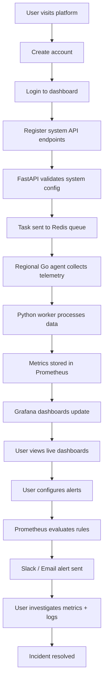

# 🔭 Upgraded Observability Platform

A production-grade, multi-tenant observability SaaS platform built with **FastAPI + Go agents + Python workers + Prometheus + Grafana + PostgreSQL + Redis**.

Monitor your infrastructure at scale with distributed telemetry collection, real-time dashboards, and enterprise-grade alerting.

---

## 📋 Table of Contents

- [Overview](#overview)
- [Tech Stack](#tech-stack)
- [Architecture](#architecture)
- [End-User Experience](#end-user-experience)
- [Quick Start](#quick-start)
- [Implementation Roadmap](#implementation-roadmap)
- [Project Structure](#project-structure)
- [Contributing](#contributing)

---

## 🎯 Overview

Upgraded Observability is a **monitored systems observability platform** enabling teams to:

✅ **Monitor distributed systems** — gather metrics, logs, and traces across multiple services
✅ **Real-time dashboards** — visualize infrastructure health with Grafana
✅ **Intelligent alerting** — detect incidents automatically and notify teams
✅ **Multi-tenant SaaS** — enable secure workspaces for multiple customers
✅ **Global scalability** — deploy collectors across regions for low-latency collection
✅ **Enterprise-ready** — support thousands of monitored endpoints with audit logs and RBAC

This architecture mirrors production systems used by **Datadog**, **New Relic**, and **Grafana Cloud**.

---

## 🧰 Tech Stack

### 1️⃣ **Frontend Layer** (User Workspace / Control Plane)

React-based dashboard for platform users.

| Component | Technology | Purpose |
|-----------|-----------|---------|
| UI Framework | React + Vite | Fast development, modern tooling |
| Styling | TailwindCSS | Production-grade component styling |
| HTTP Client | Axios | API communication with backend |
| Server State | React Query | Caching and sync with backend |

**What it does:**
- User authentication (login/signup)
- API registration and management
- Workspace/team management
- Alert configuration UI
- Dashboard navigation
- Tenant switching

---

### 2️⃣ **Backend API Layer** (Platform Orchestration)

FastAPI backend serving as the system brain.

| Component | Technology | Purpose |
|-----------|-----------|---------|
| API Framework | FastAPI | High-performance async Python |
| Validation | Pydantic | Strict request/response validation |
| Auth | JWT + OAuth2 | Secure multi-user authentication |
| ORM | SQLAlchemy | Database abstraction and queries |
| Database | PostgreSQL | Relational metadata storage |

**What it does:**
- User authentication & authorization
- Tenant isolation enforcement
- System/API registration
- Collector job scheduling
- Alert rule management
- Queue task dispatching

---

### 3️⃣ **Collector Layer** (Distributed Telemetry Agents)

Go-based agents deployed globally for telemetry collection.

| Component | Technology | Purpose |
|-----------|-----------|---------|
| Language | Go | High-performance, low memory footprint |
| Transport | HTTP/gRPC | Efficient communication |
| Queue | Redis | Job scheduling and distribution |

**What it does:**
- Poll monitored system API endpoints
- Scrape metrics from Prometheus endpoints
- Collect logs and trace metadata
- Batch telemetry for efficiency
- Push collected data to processing queue

**Deployment:** Multi-region (us-east, europe, africa, etc.)

---

### 4️⃣ **Processing Layer** (Telemetry Processing Workers)

Python-based workers for telemetry normalization and enrichment.

| Component | Technology | Purpose |
|-----------|-----------|---------|
| Task Queue | Celery | Distributed task processing |
| Message Broker | Redis | Task queue backend |
| Language | Python | Data transformation at scale |

**What it does:**
- Parse and normalize metrics
- Apply labels and tags
- Enrich telemetry with context
- Correlate related signals
- Route data to appropriate storage

---

### 5️⃣ **Metrics Storage Layer**

Time-series database for metrics ingestion.

| Component | Technology | Purpose |
|-----------|-----------|---------|
| Time-Series DB | Prometheus | Metrics collection and querying |
| Feature | Alert Rules | Native incident detection |
| Feature | Federation | Multi-node scaling |

**What it stores:**
- Metrics from all monitored systems
- System performance data
- Latency, error rates, throughput
- Alert rule state

---

### 6️⃣ **Visualization Layer**

Grafana dashboards for observability UI.

| Component | Technology | Purpose |
|-----------|-----------|---------|
| Dashboard Tool | Grafana | Rich charting and visualization |
| Feature | Plugins | Extend functionality |
| Feature | Alerting | Alert visualization & management |

**What it provides:**
- Real-time metric dashboards
- Heatmaps and latency distributions
- Error tracking panels
- Throughput and request rate charts
- Service dependency visualization

---

### 7️⃣ **Metadata Database Layer**

PostgreSQL for platform relational data.

| Component | Technology | Purpose |
|-----------|-----------|---------|
| Database | PostgreSQL | ACID compliance and reliability |

**What it stores:**
- User accounts and permissions
- Team/workspace data
- Monitored system configurations
- Alert rules and notification channels
- Audit logs and compliance records

---

### 8️⃣ **Queue / Messaging Layer**

Redis as the async scaling backbone.

| Component | Technology | Purpose |
|-----------|-----------|---------|
| Cache/Queue | Redis | In-memory data store |
| Use Case | Celery Jobs | Task distribution |
| Use Case | Collector Tasks | Agent job queue |
| Use Case | Pipeline Buffering | Data staging |

---

### 9️⃣ **Long-Term Storage Layer**

Object storage for telemetry archives.

| Component | Technology | Purpose |
|-----------|-----------|---------|
| Storage | MinIO / AWS S3 | Distributed object storage |

**What it stores:**
- Historical logs
- Trace archives
- Data exports
- Compliance snapshots

---

## 🏗️ Architecture Diagram

```
┌─────────────────────────────────────────────────────────────────┐
│                     Frontend (React + Vite)                       │
│              (Dashboard, Alerts, System Management)               │
└────────────────────────┬────────────────────────────────────────┘
                         │ HTTPS/JSON
                         ▼
┌─────────────────────────────────────────────────────────────────┐
│              FastAPI Backend (Platform Orchestration)             │
│  (Auth, System Registration, Alert Rules, Job Scheduling)        │
└──────────┬──────────────────────┬─────────────────────┬──────────┘
           │                      │                     │
           ▼                      ▼                     ▼
    ┌────────────────┐    ┌─────────────┐    ┌──────────────────┐
    │  PostgreSQL    │    │   Redis     │    │  Go Collectors   │
    │  (Metadata)    │    │  (Queue)    │    │  (Telemetry)     │
    └────────────────┘    └──────┬──────┘    └──────────────────┘
                                 │                    │
                                 ▼                    │
                        ┌─────────────────┐           │
                        │ Python Workers  │◄──────────┘
                        │ (Celery/Normalization)
                        └────────┬────────┘
                                 │
                    ┌────────────┴────────────┐
                    ▼                        ▼
            ┌──────────────┐        ┌──────────────┐
            │ Prometheus   │        │    Loki      │
            │  (Metrics)   │        │    (Logs)    │
            └──────┬───────┘        └──────┬───────┘
                   │                       │
                   └──────────┬────────────┘
                              ▼
                        ┌────────────────┐
                        │    Grafana     │
                        │ (Dashboards)   │
                        └────────────────┘
```

---

## 👤 End-User Experience

### Real-World Scenario: Monitoring a Production API

**User:** Backend engineer managing a payment processing API

#### Step 1 — Account Creation
```
1. User visits https://observability.example.com
2. Creates account and verifies email
3. Logs into workspace
```

#### Step 2 — Register Their System
```
User clicks: "Add New System"

Provides:
- System name: payments-api
- Metrics endpoint: https://api.example.com/metrics
- Logs endpoint: https://api.example.com/logs

FastAPI validates configuration
```

#### Step 3 — Collector Deployment Begins
```
Platform automatically:
1. Queues collection job
2. Assigns regional Go agent
3. Starts polling metrics endpoint

Data Pipeline:
Go Agent → Redis Queue → Python Worker → Prometheus
```

#### Step 4 — Metrics Become Visible
```
Within seconds, Grafana dashboard auto-populates:
✓ CPU usage
✓ Latency (p50, p95, p99)
✓ Error rate
✓ Request throughput
✓ Service health

User sees live telemetry
```

#### Step 5 — User Creates Alert Rule
```
User configures:
"Trigger alert if latency > 500ms for 2 minutes"

Stored in: Prometheus alert rules
Alert channels: Email, Slack, or webhook
```

#### Step 6 — Incident Happens
```
Timeline:
1. Latency spikes to 2000ms
2. Prometheus detects threshold breach
3. Grafana alert panel triggers
4. User receives Slack notification

Alert shows:
- Metric value
- Threshold
- Duration
- Related traces/logs
```

#### Step 7 — Root Cause Investigation
```
User opens dashboard and:
1. Views latency timeline
2. Checks error spike correlations
3. Reviews traffic surge
4. Navigates to logs (stored in object storage)
5. Identifies: slow database query upstream

Incident resolved ✓
```

---

## 🔄 User Workflow (Mermaid)



---

## 🚀 Quick Start

### Prerequisites

- Docker & Docker Compose
- Python 3.11+
- Go 1.21+
- Node.js 18+
- Git

### 1. Clone Repository

```bash
git clone https://github.com/yourusername/upgraded-observability.git
cd upgraded-observability
```

### 2. Set Environment Variables

```bash
cp .env.example .env
# Edit .env with your configuration
```

### 3. Start the Stack

```bash
docker-compose up --build
```

This brings up:
- FastAPI backend: `http://localhost:8000`
- Grafana: `http://localhost:3000`
- Prometheus: `http://localhost:9090`
- PostgreSQL: `localhost:5432`
- Redis: `localhost:6379`

### 4. Create a User Account

```bash
curl -X POST http://localhost:8000/register \
  -H "Content-Type: application/json" \
  -d '{
    "email": "user@example.com",
    "password": "securepassword",
    "name": "Your Name"
  }'
```

### 5. Login and Get Token

```bash
curl -X POST http://localhost:8000/login \
  -H "Content-Type: application/json" \
  -d '{
    "email": "user@example.com",
    "password": "securepassword"
  }'
```

### 6. Register a Monitored System

```bash
curl -X POST http://localhost:8000/systems \
  -H "Authorization: Bearer YOUR_TOKEN" \
  -H "Content-Type: application/json" \
  -d '{
    "name": "payments-api",
    "metrics_url": "https://api.example.com/metrics",
    "region": "us-east-1"
  }'
```

### 7. View Grafana Dashboard

Navigate to `http://localhost:3000`
- Username: `admin`
- Password: `admin`

Add Prometheus as data source: `http://prometheus:9090`

---

## 📋 Implementation Roadmap

### **Phase 1 — Minimum Working Platform (Week 1)**

**Goal:** Working local system collecting metrics and displaying dashboards.

#### Step 1 — Launch Core Stack
```
docker-compose up --build

Verify:
✓ http://localhost:8000 (FastAPI)
✓ http://localhost:3000 (Grafana)
✓ http://localhost:9090 (Prometheus)
✓ Grafana connects to Prometheus successfully
```

#### Step 2 — Add Authentication
Implement FastAPI endpoints:
- `POST /register` — User account creation
- `POST /login` — JWT token generation
- `GET /me` — User profile

Features:
- Password hashing (bcrypt)
- JWT tokens
- SQLAlchemy models in PostgreSQL

#### Step 3 — Add System Registration
Implement:
- `POST /systems` — Register monitored systems
- `GET /systems` — List user's systems
- `DELETE /systems/{id}` — Remove system

Example payload:
```json
{
  "name": "payments-api",
  "metrics_url": "https://api.example.com/metrics"
}
```

**Outcome:** Multi-user, multi-system platform skeleton

---

### **Phase 2 — Connect Telemetry Pipeline (Week 2)**

**Goal:** Real telemetry flowing into Prometheus.

#### Step 4 — Connect Go Agent to Queue
Go agent responsibilities:
- Pull jobs from Redis queue
- Call metrics endpoints
- Batch telemetry
- Push to worker queue

Basic loop:
```
poll → fetch → publish → repeat
```

#### Step 5 — Build Python Worker Layer
Python Celery worker responsibilities:
- Parse collected metrics
- Normalize format
- Apply labels
- Push to Prometheus

Queue integration:
```
Go Agent → Redis → Python Worker → Prometheus Push Gateway
```

#### Step 6 — Configure Grafana
Setup:
- Add Prometheus as data source
- Create dashboard with panels:
  - Latency (p50, p95, p99)
  - Request Rate
  - Error Rate
  - CPU/Memory usage

**Outcome:** Live metrics visible in Grafana

---

### **Phase 3 — Multi-Agent Distributed Collection (Week 3)**

**Goal:** Production-grade collectors.

#### Step 7 — Enable Regional Agent Scaling
Deploy multiple Go collectors:
```
go-agent-us-east
go-agent-europe
go-agent-africa
```

Job assignment based on:
- Geographic proximity
- Region tags
- Agent availability
- Load distribution

#### Step 8 — Implement Autoscaling Signals
Scale collectors when:
- Queue backlog increases
- Worker CPU increases
- Collection latency increases

Metrics to monitor:
```
redis_queue_depth
worker_cpu_usage
agent_collection_latency
```

**Outcome:** Elastic, globally distributed collection

---

### **Phase 4 — Observability Intelligence (Week 4)**

**Goal:** Alerts and anomaly detection.

#### Step 9 — Add Alert Rules
Prometheus alert rules:
```yaml
- alert: HighLatency
  expr: histogram_quantile(0.95, latency) > 500
  for: 2m

- alert: HighErrorRate
  expr: error_rate > 0.05
  for: 5m

- alert: DowntimeDetected
  expr: up == 0
  for: 1m
```

Channels:
- Email notifications
- Slack webhooks
- PagerDuty integration
- Custom webhooks

#### Step 10 — Add Grafana Alert Dashboards
Create panels showing:
- Incident timeline
- System health scores
- Available uptime %
- Service latency heatmaps
- Error trends

**Outcome:** Active incident detection and alerting

---

### **Phase 5 — SaaS Control Plane (Week 5)**

**Goal:** Enable multi-tenant security and scaling.

#### Step 11 — Add Multi-Tenant Isolation
Each user gets:
```
workspace_id
tenant_id
api_key
rate_limit_quota
```

Isolation at:
- API endpoint validation
- Database row-level security
- Queue task labeling
- Prometheus label filtering

#### Step 12 — Add Rate Limiting
Limit per user:
- Systems: 100/user
- Requests: 1M/month
- Collector bandwidth: 1GB/month
- Alert rules: 50/user

Implementation:
- FastAPI middleware
- Redis counters
- Quotient tracking

**Outcome:** Secure, scalable SaaS platform

---

### **Phase 6 — Logs + Traces Expansion (Week 6)**

**Goal:** Full observability stack (three pillars).

Add:
- **Loki** — Log aggregation
- **Tempo** — Trace storage
- **OpenTelemetry** — Unified instrumentation

Pipeline:
```
Metrics → Prometheus
Logs → Loki
Traces → Tempo
All → Grafana Dashboards
```

**Outcome:** Complete observability: metrics + logs + traces

---

### **Phase 7 — Production Deployment (Week 7)**

**Goal:** Deploy publicly with enterprise reliability.

Infrastructure:
```
FastAPI → 3× load-balanced containers
Workers → Autoscaled to 10-50 instances
Agents → Distributed across 5+ regions
Prometheus → Federated multi-node setup
Grafana → HA mode (active-active)
PostgreSQL → Primary + read replicas
Redis → Redis Cluster for HA
```

Deployment options:
- Kubernetes cluster
- Docker Swarm
- VPS cluster with Ansible

**Outcome:** Enterprise-grade reliability and uptime

---

## 📁 Project Structure

```
upgraded-observability/
├── app/                          # FastAPI backend
│   ├── main.py                  # Application entry point
│   ├── api/                     # API route handlers
│   │   ├── auth.py             # Authentication endpoints
│   │   ├── systems.py          # System registration APIs
│   │   ├── alerts.py           # Alert configuration APIs
│   │   └── metrics.py          # Metrics query APIs
│   ├── models/                 # SQLAlchemy database models
│   │   ├── user.py
│   │   ├── system.py
│   │   ├── alert.py
│   │   └── tenant.py
│   ├── schemas/                # Pydantic validation schemas
│   │   ├── auth.py
│   │   ├── system.py
│   │   └── alert.py
│   ├── services/               # Business logic
│   │   ├── auth_service.py
│   │   ├── system_service.py
│   │   └── alert_service.py
│   ├── workers/                # Celery task definitions
│   │   ├── metrics_worker.py
│   │   └── alert_worker.py
│   ├── core/                   # Core utilities
│   │   ├── config.py           # Environment configuration
│   │   ├── security.py         # JWT and auth utilities
│   │   └── database.py         # Database connection
│   └── requirements.txt        # Python dependencies
├── go-agent/                    # Go telemetry collector
│   ├── main.go                 # Agent entry point
│   ├── collector/              # Collection logic
│   │   ├── metrics.go
│   │   ├── logs.go
│   │   └── traces.go
│   ├── queue/                  # Redis queue client
│   └── config/                 # Configuration
├── frontend/                    # React dashboard (coming)
│   ├── src/
│   │   ├── components/
│   │   ├── pages/
│   │   ├── hooks/
│   │   └── App.jsx
│   ├── package.json
│   └── vite.config.js
├── docker/                      # Docker compose configs (coming)
│   └── docker-compose.yml
├── docs/                        # Documentation
├── .env.example                 # Environment template
├── LICENSE
└── README.md                    # This file
```

---

## 🛠️ Development

### Backend Development

```bash
# Install dependencies
pip install -r app/requirements.txt

# Run FastAPI server (dev mode with auto-reload)
uvicorn app.main:app --reload --host 0.0.0.0 --port 8000

# Run tests
pytest app/

# Run linting
black app/
flake8 app/
```

### Go Agent Development

```bash
cd go-agent

# Build agent
go build -o collector main.go

# Run agent
./collector --config config.yaml

# Run tests
go test ./...
```

### Frontend Development (Coming)

```bash
cd frontend

# Install dependencies
npm install

# Start dev server
npm run dev

# Build for production
npm run build
```

---

## 📊 Capability Summary

After full implementation, your platform will support:

| Feature | Status | Implementation Phase |
|---------|--------|---------------------|
| Multi-tenant observability | ✓ | Phase 5 |
| Distributed telemetry ingestion | ✓ | Phase 2 |
| Real-time Grafana dashboards | ✓ | Phase 2 |
| Alert rules and notifications | ✓ | Phase 4 |
| Horizontal scaling | ✓ | Phase 3 |
| Global collectors (multi-region) | ✓ | Phase 3 |
| Metrics collection | ✓ | Phase 1 |
| Logs aggregation | ✓ | Phase 6 |
| Traces collection | ✓ | Phase 6 |
| Enterprise SSO/OAuth2 | → | Post-Phase 7 |
| Data retention policies | → | Post-Phase 7 |
| Custom integrations | → | Post-Phase 7 |

---

## 🌟 Architecture Inspiration

This design mirrors production systems used by:
- **Grafana Cloud** — Distributed Prometheus collection
- **Datadog** — Multi-tenant telemetry platform
- **New Relic** — Global agent infrastructure
- **Elastic Observability** — Log/metric/trace unification

---

## 📝 Contributing

Contributions welcome! Please follow these guidelines:

1. **Branch naming:** `feature/feature-name` or `fix/bug-description`
2. **Commit messages:** Descriptive, present tense ("Add feature", not "Added feature")
3. **Code style:**
   - Python: PEP 8 (black formatter)
   - Go: `gofmt`
   - TypeScript: Prettier
4. **Testing:** All new features require tests
5. **Documentation:** Update README for architecture changes

---

## 📄 License

This project is licensed under the MIT License — see [LICENSE](LICENSE) file for details.

---

## 📞 Support

For questions or issues:
- Open a GitHub issue
- Check existing documentation
- Review architecture diagrams

---

**Built with ❤️ for observability teams everywhere**
